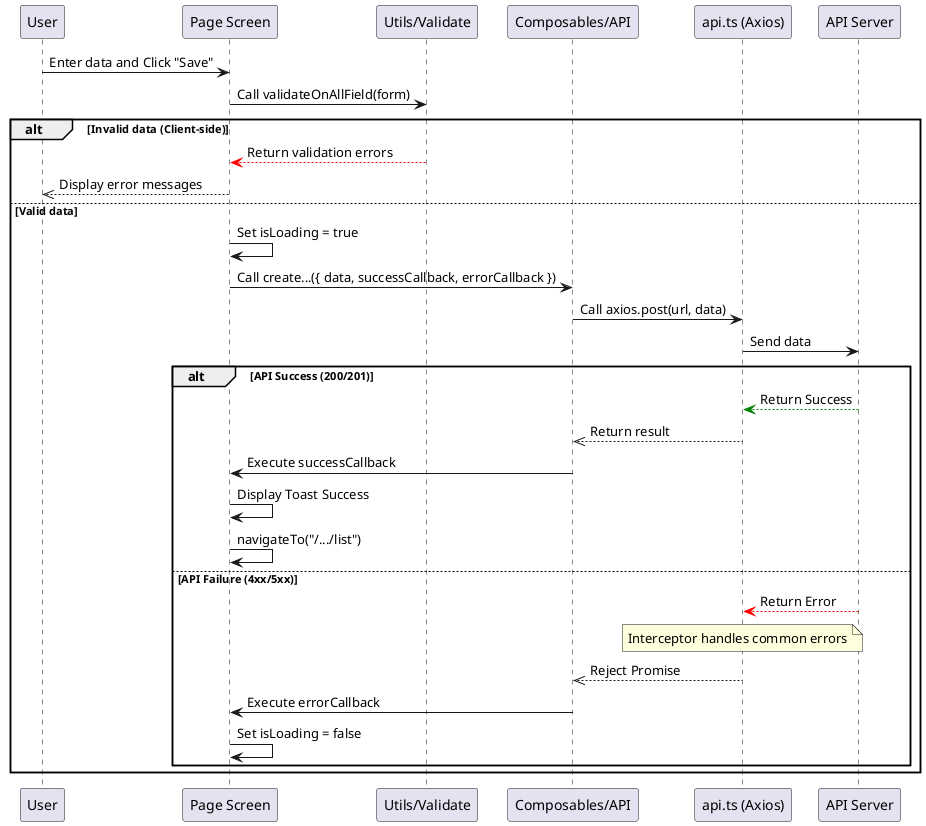
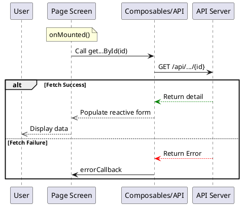
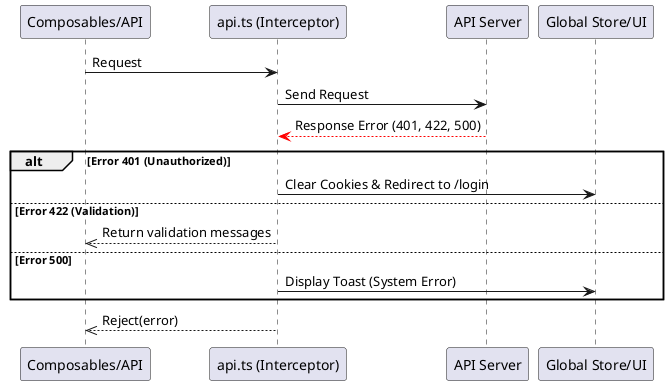

# Functional Flows (Sequence Diagrams) - Nuxt 4

This document describes the system's main functional flows using Sequence Diagrams. All Master screens follow these common patterns.

## 1. Add Flow

## 2. Edit Flow

## 3. Centralized Error Handling (`app/utils/api.ts`)

All API calls flow through the Axios instance with interceptors for session and error management.

